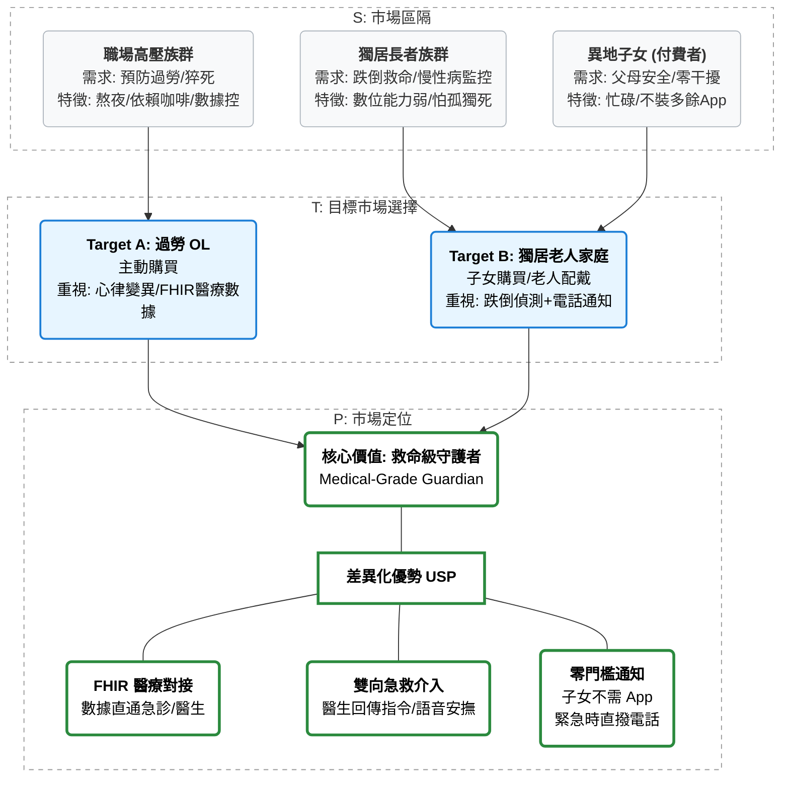
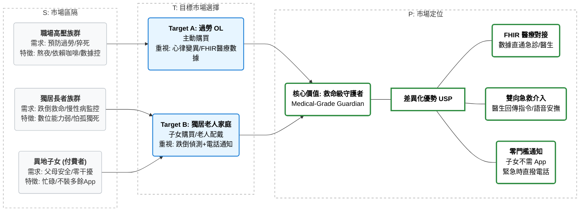

### STP

```mermaid
graph TD
    %% S區塊節點: 淺灰背景
    classDef segment fill:#f8f9fa,stroke:#adb5bd,stroke-width:1px,color:#333
    %% T區塊節點: 淺藍背景
    classDef target fill:#e7f5ff,stroke:#1c7ed6,stroke-width:2px,color:#000
    %% P區塊節點: 純白背景+綠框
    classDef position fill:#ffffff,stroke:#2b8a3e,stroke-width:3px,color:#000

    %% --- S: 市場區隔 ---
    subgraph Segmentation [S: 市場區隔]
        direction TB
        S1("<b>職場高壓族群</b><br/>需求: 預防過勞/猝死<br/>特徵: 熬夜/依賴咖啡/數據控")
        S2("<b>獨居長者族群</b><br/>需求: 跌倒救命/慢性病監控<br/>特徵: 數位能力弱/怕孤獨死")
        S3("<b>異地子女 (付費者)</b><br/>需求: 父母安全/零干擾<br/>特徵: 忙碌/不裝多餘App")
    end

    %% --- T: 目標市場 ---
    subgraph Targeting [T: 目標市場選擇]
        direction TB
        T1("<b>Target A: 過勞 OL</b><br/>主動購買<br/>重視: 心律變異/FHIR醫療數據")
        T2("<b>Target B: 獨居老人家庭</b><br/>子女購買/老人配戴<br/>重視: 跌倒偵測+電話通知")
    end

    %% --- P: 市場定位 ---
    subgraph Positioning [P: 市場定位]
        P1("<b>核心價值: 救命級守護者</b><br/>Medical-Grade Guardian")
        P2["<b>差異化優勢 USP</b>"]
        
        P2_1("<b>FHIR 醫療對接</b><br/>數據直通急診/醫生")
        P2_2("<b>雙向急救介入</b><br/>醫生回傳指令/語音安撫")
        P2_3("<b>零門檻通知</b><br/>子女不需 App<br/>緊急時直撥電話")
    end

    %% --- 連線邏輯 ---
    S1 --> T1
    S2 --> T2
    S3 --> T2
    T1 --> P1
    T2 --> P1
    P1 --- P2
    P2 --- P2_1
    P2 --- P2_2
    P2 --- P2_3

    %% --- 套用節點樣式 ---
    class S1,S2,S3 segment
    class T1,T2 target
    class P1,P2,P2_1,P2_2,P2_3 position

    %% --- 【關鍵修改】: 將大區塊背景設為透明 (fill:none) ---
    style Segmentation fill:none,stroke:#999,stroke-width:1px,stroke-dasharray: 5 5
    style Targeting fill:none,stroke:#999,stroke-width:1px,stroke-dasharray: 5 5
    style Positioning fill:none,stroke:#999,stroke-width:1px,stroke-dasharray: 5 5
```
    

```mermaid
    graph LR
    %% --- 節點樣式設定 (保持專業感) ---
    %% S區塊節點: 淺灰背景
    classDef segment fill:#f8f9fa,stroke:#adb5bd,stroke-width:1px,color:#333
    %% T區塊節點: 淺藍背景
    classDef target fill:#e7f5ff,stroke:#1c7ed6,stroke-width:2px,color:#000
    %% P區塊節點: 純白背景+綠框
    classDef position fill:#ffffff,stroke:#2b8a3e,stroke-width:3px,color:#000

    %% --- S: 市場區隔 (第一欄) ---
    subgraph Segmentation [S: 市場區隔]
        direction TB
        S1("<b>職場高壓族群</b><br/>需求: 預防過勞/猝死<br/>特徵: 熬夜/依賴咖啡/數據控")
        S2("<b>獨居長者族群</b><br/>需求: 跌倒救命/慢性病監控<br/>特徵: 數位能力弱/怕孤獨死")
        S3("<b>異地子女 (付費者)</b><br/>需求: 父母安全/零干擾<br/>特徵: 忙碌/不裝多餘App")
    end

    %% --- T: 目標市場 (第二欄) ---
    subgraph Targeting [T: 目標市場選擇]
        direction TB
        T1("<b>Target A: 過勞 OL</b><br/>主動購買<br/>重視: 心律變異/FHIR醫療數據")
        T2("<b>Target B: 獨居老人家庭</b><br/>子女購買/老人配戴<br/>重視: 跌倒偵測+電話通知")
    end

    %% --- P: 市場定位 (第三欄) ---
    subgraph Positioning [P: 市場定位]
        direction TB
        P1("<b>核心價值: 救命級守護者</b><br/>Medical-Grade Guardian")
        P2["<b>差異化優勢 USP</b>"]
        
        P2_1("<b>FHIR 醫療對接</b><br/>數據直通急診/醫生")
        P2_2("<b>雙向急救介入</b><br/>醫生回傳指令/語音安撫")
        P2_3("<b>零門檻通知</b><br/>子女不需 App<br/>緊急時直撥電話")
    end

    %% --- 連線邏輯 ---
    S1 --> T1
    S2 --> T2
    S3 --> T2
    T1 --> P1
    T2 --> P1
    P1 --- P2
    P2 --- P2_1
    P2 --- P2_2
    P2 --- P2_3

    %% --- 套用節點樣式 ---
    class S1,S2,S3 segment
    class T1,T2 target
    class P1,P2,P2_1,P2_2,P2_3 position

    %% --- 【樣式設定】: 大區塊背景透明 + 虛線外框 ---
    style Segmentation fill:none,stroke:#999,stroke-width:1px,stroke-dasharray: 5 5
    style Targeting fill:none,stroke:#999,stroke-width:1px,stroke-dasharray: 5 5
    style Positioning fill:none,stroke:#999,stroke-width:1px,stroke-dasharray: 5 5
```