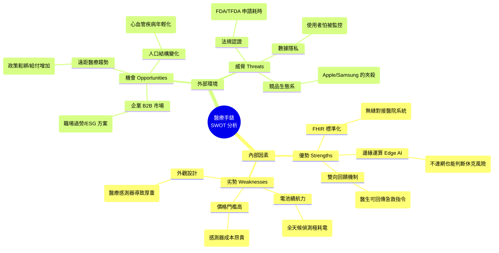

1. 內部優勢 (Strengths) —— 建立「醫療護城河」
這是您的核心競爭力，也是為什麼醫院和保險公司會選擇您，而不是 Apple Watch。

### FHIR 標準化傳輸：

解析： 這是最強的技術壁壘。一般手環的數據（CSV/Excel）醫生很難直接用，但 FHIR 是全球醫療資料交換的通用語言。

戰略意義： 這讓您的手錶能**「無縫插入」現有的醫院系統**。對於 B2B（企業/醫院）客戶來說，這節省了巨大的系統整合成本。

### 醫師雙向指令介入：

解析： 市面上的手錶多半是「單向報告」（告訴你有危險，然後就沒了）。您的產品能接收醫生的指令（如：語音安撫、震動警示），這把手錶變成了**「治療的一環」**而非僅是監測器。

### 邊緣運算 AI (Edge AI)：

解析： 不需要網路就能判斷心室頻脈或跌倒。這在地下室、電梯或網路不穩時是救命的關鍵。

2. 內部劣勢 (Weaknesses) —— 誠實面對「產品取捨」
這些劣勢其實是為了達成上述優勢所必須付出的代價（Trade-offs）。

### 高耗電/續航差：

解析： 全天候開啟醫療級感測器非常耗電。

應對策略： 不要試圖跟小米手環比續航。要教育用戶**「這是精密的醫療儀器，就像手機一樣需要每天充電」**，甚至為老人設計「座充式」的簡易充電體驗。

### 外型厚重/不時尚：

解析： 專業感測器需要空間。

應對策略： 將「厚重」轉化為「專業感」。就像專業單眼相機比手機重一樣，強調這是為了精準度而做的妥協。

### 硬體成本高：

應對策略： 這註定走高單價或訂閱制路線，不能打價格戰。

3. 外部機會 (Opportunities) —— 順勢而為
這是市場送給您的禮物，只要站在風口上就能飛。

### 企業 ESG / 健康採購：

解析： 這是目前最大的金礦。企業為了 ESG 評分和減少員工猝死賠償，非常願意編預算採購這類設備。這比一個一個賣給消費者快得多。

遠距醫療法規鬆綁：

解析： 疫情後各國政府（包括台灣）都在修法，允許更多數據用於診斷。您的 FHIR 優勢剛好接上這波法規紅利。

4. 外部威脅 (Threats) —— 生死攸關的風險
這些因素可能讓產品在上市前就夭折。

### 科技巨頭 (Apple/Samsung) 競爭：

解析： Apple 有無限的資源。

生存法則： 不要做大眾市場。專注於 Apple 不敢碰或不想做的「重度醫療」領域（例如：針對特定心臟病患、獨居老人的深度整合服務）。Apple 做的是廣度，您要做的是深度。

### 醫療器材法規 (FDA/TFDA)：

解析： 這是最花時間的一關。

應對策略： 在拿到醫材證之前，可以先以「健康管理裝置」的名義上市，但行銷用語要非常小心，避免宣稱療效。


## SWOT


```mermaid
graph TB
    %% --- 主要區塊定義 ---
    subgraph Internal_Factors [內部因素 Internal Factors]
        direction TB
        S["<b>✅ 優勢 (Strengths)</b><br/>1. FHIR 標準化傳輸<br/>2. 醫師雙向指令介入<br/>3. 邊緣運算 AI 偵測"]
        W["<b>⚠️ 劣勢 (Weaknesses)</b><br/>1. 高耗電/續航差<br/>2. 硬體成本售價高<br/>3. 外型厚重/不時尚"]
    end

    subgraph External_Factors [外部環境 External Environment]
        direction TB
        O["<b>🚀 機會 (Opportunities)</b><br/>1. 企業ESG/健康採購<br/>2. 遠距醫療法規鬆綁"]
        T["<b>⚡ 威脅 (Threats)</b><br/>1. 醫療器材法規嚴格<br/>2. 用戶隱私疑慮<br/>3. 科技巨頭(Apple)競爭"]
    end

    %% --- 配色設定 (低飽和藍色系) ---
    
    %% S: 冰川藍 (主色調) - 搭配深藍框
    style S fill:#e3f2fd,stroke:#1565c0,stroke-width:2px
    
    %% W: 迷霧灰 (冷調灰) - 搭配灰藍框
    style W fill:#eceff1,stroke:#546e7a,stroke-width:2px
    
    %% O: 薄荷青 (清新色) - 搭配青藍框
    style O fill:#e0f7fa,stroke:#006064,stroke-width:2px
    
    %% T: 岩石白 (極淺灰) - 搭配深灰框
    style T fill:#f5f5f5,stroke:#616161,stroke-width:2px

    %% --- 大框架設定 (透明背景 + 灰藍虛線) ---
    style Internal_Factors fill:none,stroke:#b0bec5,stroke-width:1px,stroke-dasharray: 5 5
    style External_Factors fill:none,stroke:#b0bec5,stroke-width:1px,stroke-dasharray: 5 5