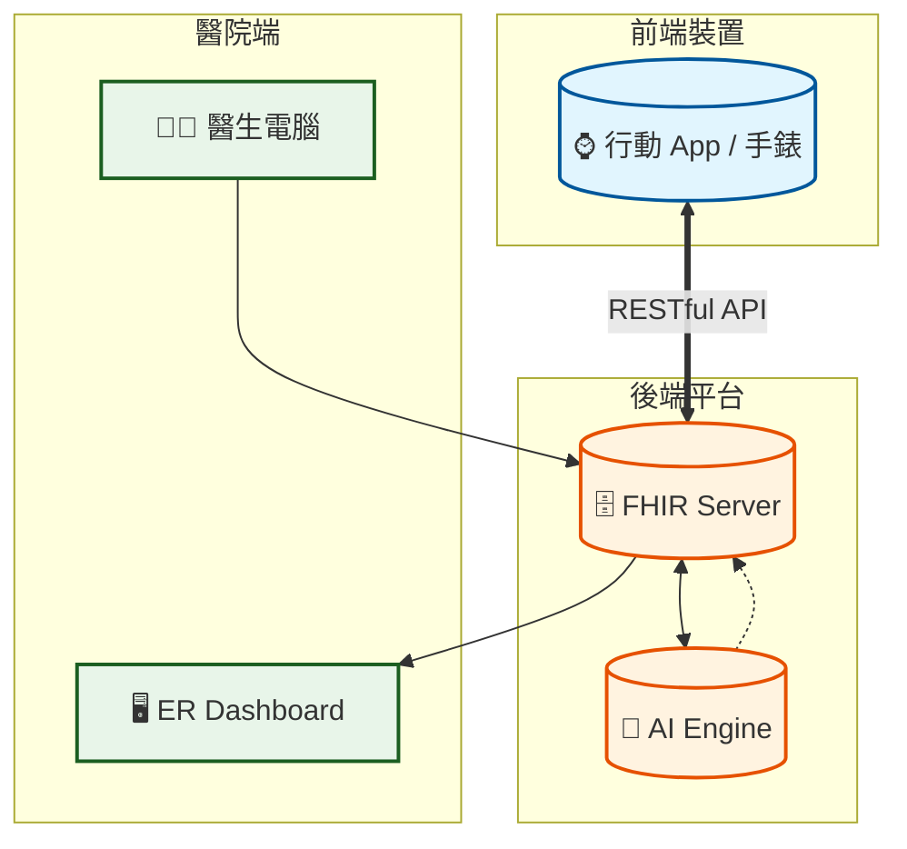
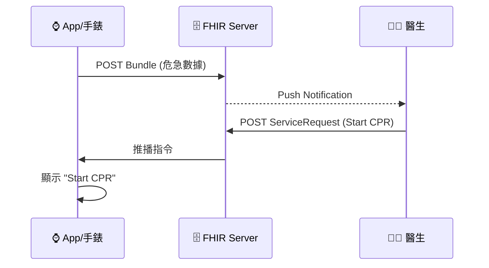

# 系統架構文件

這裡介紹我們的系統架構與急救流程。

## 1. 系統架構圖

```mermaid
graph TD
    classDef frontend fill:#e1f5fe,stroke:#01579b,stroke-width:2px;
    classDef backend fill:#fff3e0,stroke:#e65100,stroke-width:2px;
    classDef provider fill:#e8f5e9,stroke:#1b5e20,stroke-width:2px;

    subgraph Frontend_Tier [前端裝置]
        Watch[("⌚ 行動 App / 手錶")]:::frontend
    end

    subgraph Backend_Tier [後端平台]
        FHIR[("🗄️ FHIR Server")]:::backend
        AI[("🧠 AI Engine")]:::backend
    end

    subgraph Provider_Tier [醫院端]
        Dashboard["🖥️ ER Dashboard"]:::provider
        DoctorPC["👨‍⚕️ 醫生電腦"]:::provider
    end

    Watch <==>|RESTful API| FHIR
    FHIR <--> AI
    FHIR --> Dashboard
    DoctorPC --> FHIR
    AI -.-> FHIR
```

## 2. 急救回應流程 (Emergency Response)

```mermaid
sequenceDiagram
    participant Watch as ⌚ App/手錶
    participant FHIR as 🗄️ FHIR Server
    participant Doc as 👨‍⚕️ 醫生

    Watch->>FHIR: POST Bundle (危急數據)
    FHIR-->>Doc: Push Notification
    Doc->>FHIR: POST ServiceRequest (Start CPR)
    FHIR->>Watch: 推播指令
    Watch->>Watch: 顯示 "Start CPR"
```
